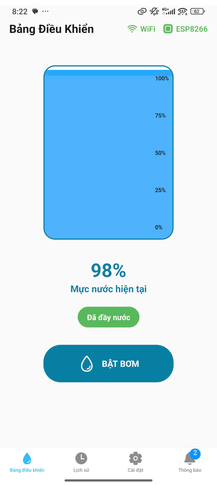
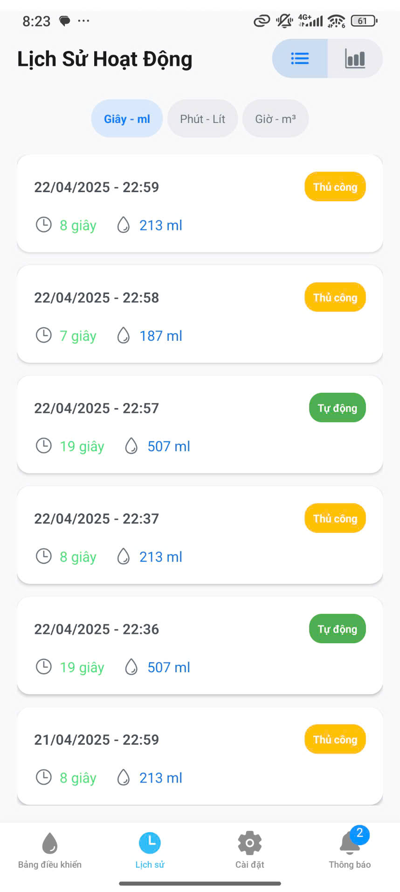
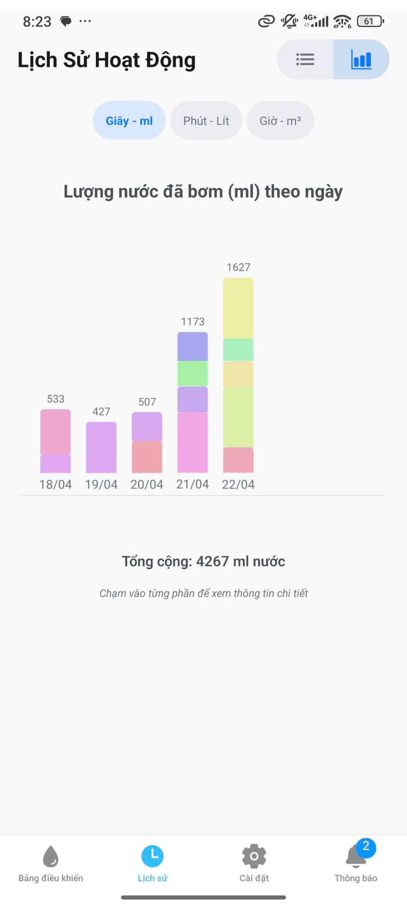
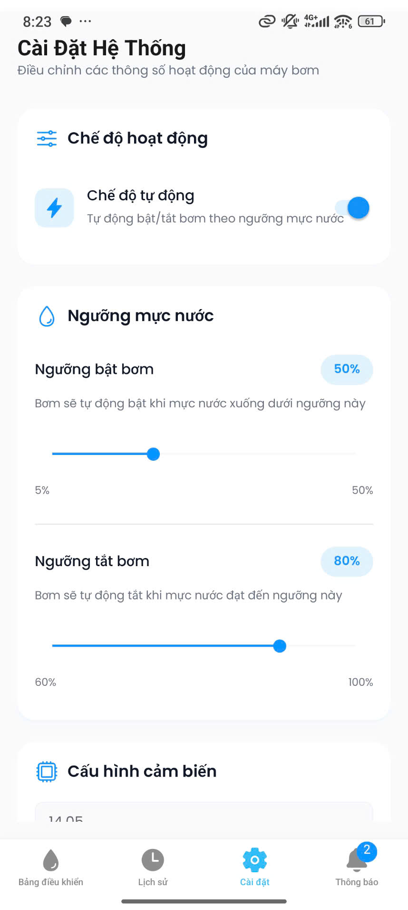
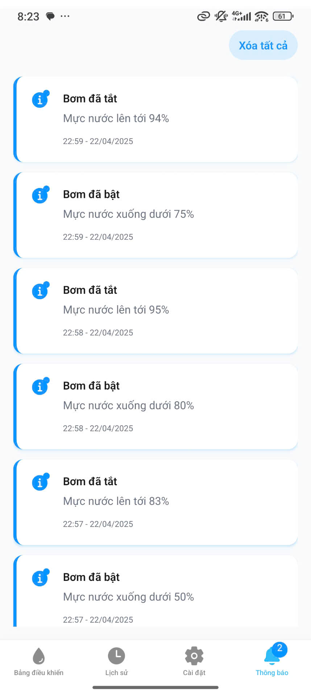

# 💧 Hệ Thống Giám Sát & Điều Khiển Máy Bơm Thông Minh

<div align="center">
  


</div>

<p align="center">Ứng dụng giám sát và điều khiển máy bơm nước từ xa, sử dụng ESP8266 và Firebase.</p>

## ✨ Tính Năng Chính

<table>
  <tr>
    <td width="50%">
      <h3>🔍 Giám Sát Thời Gian Thực</h3>
      <ul>
        <li>Hiển thị mực nước với hiệu ứng trực quan</li>
        <li>Cập nhật trạng thái liên tục</li>
        <li>Báo động khi mực nước quá thấp</li>
      </ul>
    </td>
    <td width="50%">
      <h3>🎮 Điều Khiển Từ Xa</h3>
      <ul>
        <li>Bật/tắt máy bơm từ bất kỳ đâu</li>
        <li>Giao diện điều khiển đơn giản, hiệu quả</li>
        <li>Phản hồi tức thì từ thiết bị</li>
      </ul>
    </td>
  </tr>
  <tr>
    <td width="50%">
      <h3>⚙️ Chế Độ Tự Động</h3>
      <ul>
        <li>Cài đặt ngưỡng bật/tắt theo mực nước</li>
        <li>Hoạt động không cần giám sát</li>
        <li>Tiết kiệm thời gian và năng lượng</li>
      </ul>
    </td>
    <td width="50%">
      <h3>📊 Thống Kê & Lịch Sử</h3>
      <ul>
        <li>Theo dõi lượng nước đã bơm</li>
        <li>Phân tích dữ liệu theo thời gian</li>
        <li>Nhiều đơn vị hiển thị tùy chọn</li>
      </ul>
    </td>
  </tr>
</table>

## 🚀 Công Nghệ Sử Dụng

- **🖥️ Frontend**: React Native / Expo / TypeScript
- **☁️ Backend**: Firebase Realtime Database
- **🔌 Hardware**: ESP8266, HC-SR04, Relay
- **🎭 Animation**: React Native Reanimated
- **🧰 Navigation**: Expo Router

## 🏗️ Kiến Trúc Hệ Thống

### Cấu Trúc Phần Mềm
```
   /devices/device1/
  ├── name                   # Tên thiết bị
  ├── status/                # Trạng thái hiện tại
  │   ├── isPumpOn           # Trạng thái máy bơm
  │   ├── waterLevel         # Mực nước hiện tại (%)
  │   ├── wifiConnected      # Trạng thái kết nối WiFi
  │   └── lastUpdated        # Thời điểm cập nhật cuối
  └── settings/              # Cài đặt
      ├── isAutoMode         # Chế độ tự động
      ├── minWaterLevel      # Ngưỡng bật bơm (%)
      ├── maxWaterLevel      # Ngưỡng tắt bơm (%)
      ├── sensorToBottom     # Khoảng cách từ cảm biến đến đáy bể (cm)
      ├── tankHeight         # Chiều cao bể nước (cm)
      └── pumpFlow           # Lưu lượng bơm (L/phút)

/history/device1/
  └── events/               # Sự kiện bơm
      └── evt_{timestamp}/  # Chi tiết sự kiện
            ├── mode
            ├── waterLevel
            ├── duration
            ├── amountLiters
            ├── startPump
            ├── endPump
      └── evt_{timestamp}
         ...
      └── evt_{timestamp}
         ...
      ...
/notifications/device1/
  └── ntf_{timestamp}/      # Thông báo hệ thống
```

## 📸 Screenshots
<div align="center">
  <div style="display: flex; flex-direction:row; gap: 10px;">
    
    
  </div>
  <div style="display: flex; flex-direction:row; gap: 10px;">
    
    
    
  </div>
</div>
